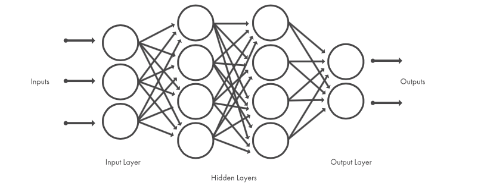

# CyPer - Cyclist Performance Prediction Model

The whole visualisation (including a customizable dashboard) for CyPer is avaiable under: [CyPer](https://public.tableau.com/profile/jo105#!/vizhome/RuffRiderBoard/RuffRiderBoard)

## Abstract
Sports are developing towards increasingly scientific training methods with increasing amounts of data being collected from training sessions, bike packing trips, ultra races and competitions. In cycling, it is standard to equip bicycles with small computers recording data from sensors such as power-meters, in addition to heart-rate, speed, altitude etc. Recently, machine learning techniques have provided huge success in a wide variety of areas where large amounts of data (“big data”) is available. In this project, I perform a experiment on machine learning to model power response in cyclists. The project shows that it is possible to train a deep neural network machine learning algorithm to predict the power in Watts (a measure of how much energy you are placing into the pedals) of a cyclist for a ride. 

## Introduction
Recently development in the ICT (information and communications technology) sector has cyclists with vast amount of data being available from GPS sensors, heart rate monitors and power meters. Collected over time it becomes a lot of data that can be used to design training programs and follow up training loads with target to peak performance with reduced risk of overreaching, which otherwise may result in injuries, sickness, and degraded performance. 
In 2010 the training stress score (TSS) was defined, which is a key number that is calculated from real- time work intensity related to each subject documented critical intensity, defined through either power, heart rate or speed. Despite being widely used for assessment of training, TSS still considers only one variable, e.g., the power. The nonlinear intensity relationships in the TSS formula are also ad-hoc without any clear motivation about the nonlinear relationship used.
One of the challenges in modelling physiological and biological systems is the large number of stimulus involved making it impossible to clearly define the governing dynamics needed for an analytical model starting from first principles.
With the rise of computing power and availability of large amounts of digital data, machine learning has revolutionised many fields. There exists a wide range of machine learning algorithms. Here, we are mainly concerned with supervised learning algorithms, which typically have in common that they model complex statistical relationships, implemented as adjustable weights in the model. These weights are typically gradually adjusted to fit a set of training data, containing labelled examples (for instance pictures of animals labelled by their species), followed by an evaluation on unseen validation data to assess how well the model generalises to novel examples.

In the project considered data in the form of activity summaries collected from veloviewer.com / STRAVA recorded during rides of different cyclists. The project apply deep-learning methods, which have revolutionised many applications of machine learning. Specifically, we use a so called deep neural network.
While this is not the ultimate goal from a performance analysis point of view, it is a suitable evaluator for assessing if machine learning at all can capture and encode the dependencies between different physiological and performance factors.

## Methods
The project had collected a dataset from various cyclists all over the world. The observations in the dataset each correspond to one training session / ride / bike packing trip / race etc. Small devices record a mass of information during an activity including information from various sensors, e.g. heart rate monitor, power meter (if the bike is equipped with one), GPS position, altitude, speed etc.
The quality of the data varied between different individuals, with some always riding with a heart rate monitor and power meter, while others rarely rode with sensors on the bike. Furthermore, the sensors are not always measuring perfectly and some sessions contained obviously spurious values. At the end the project using data from 136 cyclists (gender is not known) for the experiments described here.

As a first experiment in applying machine learning to performance data from cyclists it was decided to attempt to train a machine learning algorithm to predict the power for any given session (ride / bike packing trip / race...). Starting with a brief overview of the kind of machine learning algorithms used, followed by a more detailed description of how to train and evaluat a model for predicting power.

## A Brief Introduction to Deep Neural Networks

Most deep learning methods use neural network architectures, which is why deep learning models are often referred to as deep neural networks.

The term “deep” usually refers to the number of hidden layers in the neural network. Traditional neural networks only contain 2-3 hidden layers, while deep networks can have as many as 150.

Deep learning models are trained by using large sets of labeled data and neural network architectures that learn features directly from the data without the need for manual feature extraction.

Neural networks, which are organized in layers consisting of a set of interconnected nodes. Networks can have tens or hundreds of hidden layers.

When using machine learning algorithms, the available data is typically divided into a larger training set and a smaller evaluation set. The training set is used to train the chosen model. To ensure the model has learned
parameters that generalise also to new data, the performance of the model is evaluated on the unseen evaluation set.

## Predicting POWER (WATTS)

Given the successes found in the literature, and the nature of the data it was attempt to implement a DNN and train it to predict power in watt of a cyclist. While this is not the ultimate goal, it serves as a good first indicator to evaluate if the machine learning model manages to learn some representation of physical response. A trained DNN cannot only be used for prediction, but also for producing compact encodings of the data, as numeric vectors called embeddings.

The source code which was used to run these experiments is available in [CyPer_TensorFlow](CyPer_TensorFlow.ipynb) and is based on the TensorFlow library written in Python. The target of this experiment was to predict power for any observation, given input variables (broken down to a minimum):

- distance in km_km
- elvation gain in m
- elapsed time in s
- moving time in s
- start time in s
- average speed in km/h
- cadence (pedal strokes/minute)
- average heart rate in bpm
- elvation high in m
- elvation low in m
- average temperature in °C'
- date
- power in Watts

In the pre-processing step a data cleaning, data exploraation and feature engineering was executed for the raw data. 
All input parameters were standardised (rescaled) to mean 0 and standard deviation 1 to avoid introducing artificial bias in any variables, as units vary between the different inputs (this is standard in machine learning applications).
 
The final dataset used for this experiment thus consisted of 110387 observations from 102 cyclists. Finally, as is common practice in machine learning, the data was split into a training set, consisting of data from 88309 observations,
and a test set, consisting of data from 22078 observations. After training, the model was evaluated on the unseen test set.

## Results

The trained DNN obtained a final Mean Squared Error (MSE) of 39.98 on the test set. 

The Figure show our trained models predictions on the test set. 
The model’s predictions are close to the actual power measured no matter of the specifics of an observation. 
This indicates that the DNN has indeed managed to learn a representation for the cyclists’ physical response. 

The figure above show the error distribution for the model. 
It is getting clear that main fault tolerancethe is between -1.5 watt and 2 watt.

## Limitations

Unknown information:
- cyclists
    - gender
    - weight
    - size
    - age
- normal heights (height above sea level) and related oxygen content
- air resistance
- bike information
    - weight
    - tire width and related rolling resistance

## Further work
- split data into training and validation set based on cyclists
- add additonal data based on 'limitations'
- include the FTP (Functional Threshold Power)

## Nice to know
The greatest weight-related power measured in competition was recorded for the former Italian professional cyclist Marco Pantani, who conquered the legendary L'Alpe d'Huez climb in 1997 with 7.2 watts/kg in 37:35 minutes. 
**That results in an average power of 410 watt.**

